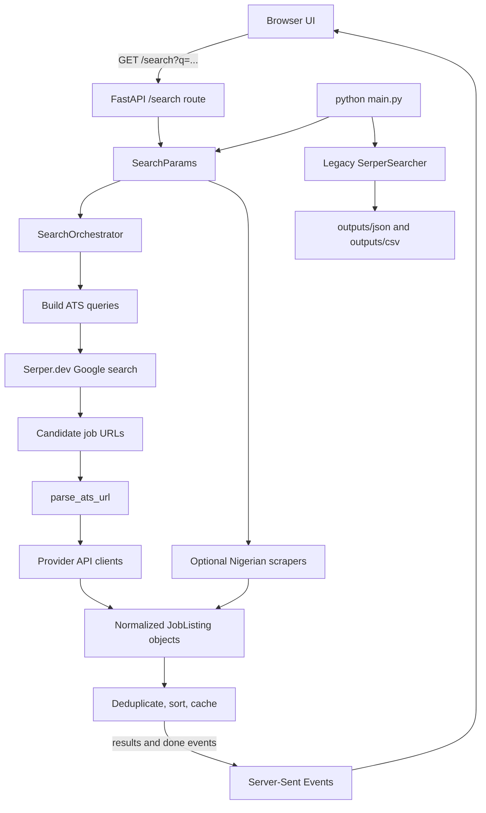

# Bottom Pot: A Build-It-Yourself Walkthrough

This document explains the current Bottom Pot project from the ground up. It is written for someone who knows intermediate Python and the basics of JavaScript, HTML, and CSS, but has not yet built a complete browser application backed by FastAPI.

The goal is not only to describe what the code does. The goal is to explain **why each layer exists**, how the layers communicate, and how you could rebuild the project in small steps yourself.

## 1. What This Project Does

Bottom Pot searches public job listings from applicant tracking systems (ATSs) such as Greenhouse, Lever, Ashby, Workable, and others.

The system has two ways to run a search:

1. The command-line interface in `main.py` searches with the older `SerperSearcher` implementation and writes JSON and CSV files.
2. The FastAPI application in `src/api/main.py` powers the browser frontend. It streams results as they arrive, so the page can show progress before the whole search is finished.

Both paths use a shared `SearchParams` Pydantic model, but they do not use exactly the same search pipeline. This is important when you are reading the repository:

```text
CLI path:
main.py -> SerperSearcher -> QueryBuilder -> Serper.dev -> raw results -> JSON/CSV

Browser path:
frontend/app.js -> FastAPI /search -> SearchOrchestrator
             -> Serper.dev -> ATS API enrichment
             -> optional Nigerian HTML scrapers
             -> deduplicate/cache -> Server-Sent Events -> browser table
```

## 2. The Big Picture



### Current file map

```text
main.py                              CLI entry point
frontend/index.html                  Browser markup and form
frontend/app.js                      SSE client, table rendering, filters, CSV export
frontend/styles.css                  Browser layout and visual styling
src/api/main.py                      FastAPI app, routes, SSE response, static mount
src/config.py                        Environment-backed runtime settings
src/project_files/config.py          20 ATS platform definitions and legacy Serper settings
src/project_files/models.py          Pydantic data contracts
src/project_files/query_builder.py   Google/Serper query construction
src/project_files/search_pipeline.py Concurrent browser search orchestration
src/project_files/ats_url_parser.py  Known ATS URL recognition
src/project_files/ats_api_client.py  Dedicated structured clients for supported ATS APIs
src/project_files/ats_page_enricher.py Generic JobPosting JSON-LD/page metadata extraction
src/project_files/serper_searcher.py Legacy CLI Serper client
src/project_files/nigerian_scrapers.py Direct Nigerian HTML scrapers
src/project_files/retry.py            Async retry decorator
tests/                               Automated behavior checks
```

### The core idea

Serper.dev is used as a **discovery layer**. It finds URLs that look like job pages. The project then tries to fetch structured details directly from the ATS provider. This is better than treating Google snippets as the final data source because provider APIs usually contain cleaner titles, companies, locations, dates, and application URLs.

Seven providers have dedicated API clients. The other configured ATS platforms are enriched by fetching the public job page and reading standard `JobPosting` JSON-LD or date metadata. If a page cannot be fetched or does not expose structured metadata, the system keeps a snippet-based record rather than dropping the result. One provider failing should not destroy the complete search.

The browser search uses the same 20-platform registry and three Serper pages per platform as the CLI. That is up to 60 Serper requests for a broad search, capped at 100 returned jobs, with a 90-second hard timeout. Each page's job enrichment runs concurrently so the search is not unnecessarily slowed by one URL at a time.

## 3. Recommended Reading Order

If you are learning this project, read it in this order:

1. [src/project_files/models.py](src/project_files/models.py) — understand the shapes of the data.
2. [src/project_files/query_builder.py](src/project_files/query_builder.py) — see how user input becomes Google queries.
3. [src/api/main.py](src/api/main.py) — understand the web API boundary.
4. [src/project_files/search_pipeline.py](src/project_files/search_pipeline.py) — follow the real browser search.
5. [frontend/index.html](frontend/index.html), [frontend/app.js](frontend/app.js), and [frontend/styles.css](frontend/styles.css) — see how the browser talks to the API.
6. [src/project_files/ats_url_parser.py](src/project_files/ats_url_parser.py) — understand URL recognition.
7. [src/project_files/ats_api_client.py](src/project_files/ats_api_client.py) — understand provider-specific enrichment.
8. [src/project_files/nigerian_scrapers.py](src/project_files/nigerian_scrapers.py) — understand direct HTML scraping.
9. [main.py](main.py) and [src/project_files/serper_searcher.py](src/project_files/serper_searcher.py) — understand the older CLI path.
10. The tests — learn the expected behavior from small examples.

## 4. Running the Project

This section is the complete startup procedure. Run the commands from the repository root, the folder containing `main.py`, `requirements.txt`, and `src/`.

### 4.0 Open the project in a terminal

Windows PowerShell:

```powershell
Set-Location "C:\Users\Richmond\Desktop\Codebase\bottom-pot-v1"
Get-Location
Get-ChildItem
```

You should see `main.py`, `requirements.txt`, `src`, `frontend`, `tests`, and `README.md`. If `Get-Location` shows a different folder, use `Set-Location` with the correct path.

### 4.1 Create an environment

From the repository root:

```bash
python -m venv venv
```

Windows PowerShell:

```powershell
.\venv\Scripts\Activate.ps1
```

If PowerShell blocks activation with an execution-policy message, you can either run the activation command in Command Prompt:

```cmd
venv\Scripts\activate.bat
```

or allow scripts for your current PowerShell process only:

```powershell
Set-ExecutionPolicy -Scope Process -ExecutionPolicy Bypass
.\venv\Scripts\Activate.ps1
```

macOS or Linux:

```bash
source venv/bin/activate
```

Install dependencies:

```bash
pip install -r requirements.txt
```

Confirm that the terminal is using the virtual environment:

```powershell
python --version
python -m pip --version
```

Using `python -m pip` is helpful because it makes the `pip` command belong to the same Python interpreter as the `python` command.

### 4.2 Configure the Serper key

Create `.env` in the project root:

```text
SERPER_API_KEY=your_serper_key_here
```

The key is a secret. Do not commit `.env`, put it in screenshots, or send it to the browser. The backend reads it; the frontend never receives it.

On Windows PowerShell, you can create the file interactively:

```powershell
notepad .env
```

Put this line in the file:

```text
SERPER_API_KEY=your_real_key_here
```

Save and close Notepad. The repository's `.gitignore` should keep `.env` out of Git. Never replace the key with quotes unless the key itself contains quotes.

### 4.3 Start the web application

```bash
uvicorn src.api.main:app --reload
```

On Windows PowerShell, the equivalent command is exactly the same:

```powershell
python -m uvicorn src.api.main:app --reload
```

The second form is useful when the `uvicorn` executable is not found, because it asks the active Python interpreter to run the installed module. Leave this terminal running. Open a second terminal for tests or API commands.

Open:

```text
http://127.0.0.1:8000/
```

`uvicorn` is an ASGI server. It imports the `app` object from `src.api.main` and listens for HTTP requests. `--reload` watches the project and restarts the development server after Python changes.

Expected startup output includes:

```text
Uvicorn running on http://127.0.0.1:8000
Application startup complete.
```

To stop the server, focus its terminal and press `Ctrl+C`. Do not close the terminal while you are using the website.

Useful URLs:

```text
GET  /              Browser application
GET  /health        Health check
GET  /docs          FastAPI-generated interactive API documentation
GET  /search        Streaming search endpoint
POST /subscribe     Save an email subscription
```

### 4.3.1 Verify the server before opening the UI

PowerShell:

```powershell
Invoke-WebRequest http://127.0.0.1:8000/health | Select-Object -ExpandProperty Content
```

Expected response:

```json
{"status":"ok","version":"2.0.0"}
```

You can also check the frontend itself:

```powershell
Invoke-WebRequest http://127.0.0.1:8000/ | Select-Object -ExpandProperty StatusCode
```

Expected status: `200`.

The interactive API page is available at `http://127.0.0.1:8000/docs`. It is generated by FastAPI from the route definitions and is useful for inspecting query parameters without writing frontend code.

### 4.3.2 Call the search API directly

The search endpoint returns Server-Sent Events, not one normal JSON object. In PowerShell, use the browser for the most convenient experience. For a quick request check, this command prints the streamed response:

```powershell
$uri = "http://127.0.0.1:8000/search?q=Backend%20Engineer&location=Lagos&days_back=7&remote=true&include_nigerian=false"
Invoke-WebRequest $uri -Headers @{ Accept = "text/event-stream" } | Select-Object -ExpandProperty Content
```

The response contains blocks shaped like:

```text
event: results
data: {"batch":[...],"total_so_far":12}

event: done
data: {"total":12,"search_time_ms":...,"cached":false,...}

```

The blank line after each event is part of the SSE protocol. The frontend reads these events incrementally with `fetch()` and a stream reader.

### 4.3.3 Understand search cost and duration

The default browser search can issue:

```text
20 ATS platform queries x 3 Serper pages = up to 60 Serper requests
```

Each Serper page costs one credit. The search is capped at 100 normalized results and can run for up to 90 seconds. The Nigerian scrapers add direct website requests when their checkbox is enabled. A narrower search using a location, remote option, or specific CLI platforms costs less and usually finishes faster.

### 4.4 Run the CLI

```bash
python main.py --job-title "Data Engineer"
```

The CLI writes files under `outputs/json/` and `outputs/csv/`.

For a Windows PowerShell multiline command, use the backtick continuation character:

```powershell
python main.py `
    --job-title "Backend Engineer" `
    --remote `
    --days-back 3 `
    --max-results 50
```

For a normal one-line command:

```powershell
python main.py --job-title "Product Designer" --platforms greenhouse,lever,ashby
```

The CLI and browser use the same 20-platform registry, but the CLI uses the legacy `SerperSearcher` output path and writes raw Serper records. The browser uses `SearchOrchestrator`, enrichment, deduplication, caching, and SSE.

### 4.5 Run tests

```bash
pytest
```

The current suite covers URL parsing, query building, caching, rate limiting, API endpoints, and selected provider/scraper behavior.

Useful test commands:

```powershell
# Run everything
pytest

# Run only API/frontend smoke tests
pytest tests/test_api_endpoints.py

# Run ATS parser tests
pytest tests/test_ats_url_parser.py

# Run provider, scraper, and generic JobPosting extraction tests
pytest tests/test_scrapers_and_clients.py

# Run one test with detailed output
pytest tests/test_scrapers_and_clients.py -k generic -vv
```

The expected full-suite result for the current project is 52 passing tests, with a SlowAPI deprecation warning that does not fail the suite.

## 5. Python Concepts Used Here

### 5.1 A module and a package

A `.py` file is a module. A directory containing `__init__.py` is treated as a package. For example:

```python
from src.project_files.models import SearchParams
```

Python finds the `src` package, then `project_files`, then imports `SearchParams` from `models.py`.

### 5.2 Type annotations

Annotations describe expected values:

```python
def parse_ats_url(url: str) -> ParsedATSUrl | None:
```

This says the function accepts a string and returns either a `ParsedATSUrl` or `None`. Python does not enforce every annotation at runtime, but tools such as Pylance use them to catch mistakes.

### 5.3 Async and await

Network requests spend most of their time waiting. An `async def` function can pause at `await` while the event loop works on another task.

```python
async def fetch_data():
    response = await client.get(url)
    return response.json()
```

`await` does not make one request faster. It lets one process manage many waiting requests efficiently.

### 5.4 Async generators

`SearchOrchestrator.run()` is an async generator because it both waits for asynchronous work and yields multiple values over time:

```python
async for event_name, event_data in orchestrator.run(params):
    ...
```

This is what makes progressive streaming possible.

### 5.5 Pydantic models

Pydantic turns untrusted dictionaries and request parameters into validated Python objects. A `JobListing` object has a known shape, and FastAPI can serialize it to JSON.

### 5.6 Decorators

`@app.get("/health")` registers a function as an HTTP route. `@with_retry(...)` wraps a network function with retry behavior. A decorator receives a function and returns another function with extra behavior.

### 5.7 Dataclasses

`CacheEntry` and `ParsedATSUrl` use `@dataclass` because they are simple containers. Pydantic models are used where validation and JSON serialization are especially useful.

## 6. Data Models: The Contracts Between Layers

All models are in [src/project_files/models.py](src/project_files/models.py).

### `SearchParams`

This is the input contract for a search:

| Field | Meaning |
|---|---|
| `job_title` | Required role or keyword string |
| `location` | Optional location text |
| `salary_min` | Optional salary hint used by the CLI query builder |
| `experience_level` | Optional `entry`, `mid`, `senior`, or `lead` hint |
| `exclude_keywords` | Words to exclude from search results |
| `max_results` | Maximum number of results |
| `remote` | `True` means remote only, `False` excludes remote, `None` means either |
| `days_back` | Freshness window |
| `country_code` | Optional Google country index such as `us` or `gb` |
| `include_nigerian_sites` | Whether direct Nigerian scrapers should run |

The browser currently fills only the role, location, remote mode, days, and Nigerian-site fields. The CLI exposes more fields.

### `ATSConfig`

Describes an ATS platform:

```text
name          Internal identifier, such as greenhouse
site_operator Domain used in a Google site: query
label         Human-readable name
```

### `RawSearchResults`

This is the older, lightweight result shape from Serper. It contains the URL, title, snippet, ATS source, query, and timestamp. The legacy CLI uses this model.

### `JobListing`

This is the normalized result shape used by the FastAPI pipeline and frontend. Different providers use different field names, so each provider client converts its response into this common shape.

Important fields:

- `id`: stable identity used for deduplication.
- `provider`: normalized provider name.
- `data_source`: `api`, `scrape`, or `snippet`.
- `title`, `company`, `location`: user-facing job data.
- `employment_type`: normalized to `full_time`, `part_time`, `internship`, or `contract` when available.
- `work_model`: normalized to `remote`, `hybrid`, or `in_person` when available.
- `department`: provider metadata retained in the API model; it is not shown as a primary table column.
- `posted_at`: the exact provider publication/creation date when available.
- `apply_url`: link the user should open.
- `source_url`: original URL discovered through Serper.
- `query_used`: the generated query that found the job.

#### `freshness_label`

This is a computed Pydantic field for API compatibility. It is not the browser's exact-date display. The browser formats `posted_at` as `YYYY-MM-DD`; if `posted_at` is missing it displays `Date unavailable`. `freshness_label` returns labels such as `Today`, `Yesterday`, `3 days ago`, or `Recently posted` for consumers that want relative wording.

### `ResultsBatch`, `DoneEvent`, and `ErrorEvent`

These are the three event payload shapes used by the streaming API:

```text
results -> a list of new JobListing objects and a running total
done    -> final totals, timing, providers, cache state
error   -> a message and machine-readable error code
```

### `SubscribeRequest`

Validates an email address and allows an optional search query. FastAPI uses this model for `POST /subscribe`.

### `SearchResponse`

This describes a complete, non-streaming response, but the current API does not return it. It is a useful future model if you later add a JSON endpoint.

## 7. FastAPI: The Web Backend

The web backend is [src/api/main.py](src/api/main.py).

### Application setup

```python
app = FastAPI(title="Bottom Pot API", version="2.0.0")
```

This creates the application object that Uvicorn serves.

The module also creates:

- A `slowapi` limiter keyed by the caller's IP address.
- A rate-limit exception handler.
- CORS middleware. It currently allows all origins; restrict this in production.
- One shared `SearchOrchestrator` instance.

### `health()`

```python
@app.get("/health")
async def health():
```

This returns a small JSON object. Health endpoints are useful for monitoring and for quickly checking whether a server process is alive without performing an expensive search.

### `search(...)`

This is the main API route:

```text
GET /search?q=Backend+Engineer&location=Lagos&remote=true&days_back=7
```

FastAPI reads and validates the query parameters:

- `q` is required and must contain 2 to 100 characters.
- `location` is optional and capped at 100 characters.
- `remote` is an optional boolean.
- `days_back` must be between 1 and 90.
- `platforms` is an optional comma-separated string.
- `include_nigerian` defaults to `true`.

The route does not expose a browser `max_results` control. The server uses `settings.max_results`, currently 100. The route also does not expose a page-count control; the server uses `settings.serper_max_pages`, currently 3.

The function converts those values into `SearchParams`, then returns a `StreamingResponse` whose media type is `text/event-stream`.

#### The nested `event_generator()`

This nested async generator loops over the orchestrator:

```python
async for event_name, event_data in orchestrator.run(...):
```

Each Pydantic event is converted to JSON with `model_dump_json()`. It is wrapped in the SSE format:

```text
event: results
data: {"batch": [...], "total_so_far": 4}

```

The blank line is part of the SSE protocol. It tells the browser that one event has ended.

If an unexpected exception escapes the pipeline, the generator emits an `error` event rather than abruptly ending the connection.

### `subscribe(body)`

This endpoint appends a validated email and optional query to a CSV file. It:

1. Checks whether the configured file already exists.
2. Opens it in append mode.
3. Writes a header if this is the first row.
4. Writes the email, query, and UTC timestamp.
5. Returns `{"subscribed": true}`.

This is intentionally simple. It is not a full subscription system with confirmation emails, database storage, or unsubscribe handling.

### Static frontend mount

At the bottom of the module:

```python
frontend_dir = Path(__file__).resolve().parents[2] / "frontend"
app.mount("/", StaticFiles(directory=frontend_dir, html=True), name="frontend")
```

`Path(__file__)` points to `src/api/main.py`. `parents[2]` moves up to the repository root. The frontend directory is then mounted at `/`, so `frontend/index.html` becomes `/` and `frontend/app.js` becomes `/app.js`.

The API routes are registered before the root mount, so `/health` and `/search` still reach FastAPI handlers.

## 8. Query Building

Query logic is in [src/project_files/query_builder.py](src/project_files/query_builder.py).

### `build_ats_query(domain, params)`

This newer helper builds a compact query like:

```text
site:boards.greenhouse.io "Backend Engineer" "remote" "Lagos" -"contract"
```

It performs these steps:

1. Start with `site:<domain>`.
2. Add the quoted job title.
3. Add `"remote"` for remote-only searches or `-"remote"` for exclude-remote searches.
4. Add the location, quoting it when it contains spaces.
5. Add each excluded keyword as a negative quoted term.
6. Join all pieces with spaces.

### `build_ats_queries(params, platforms=None)`

This returns a dictionary such as:

```python
{
    "greenhouse": "site:greenhouse.io ...",
    "lever": "site:jobs.lever.co ...",
}
```

When `platforms` is omitted, it uses the 20 domains in `ATS_DOMAINS`, matching the CLI registry. When supplied, it filters to those names.

### `QueryBuilder.__init__(ats)`

Stores one `ATSConfig` instance. The legacy searcher creates one builder per platform.

### `QueryBuilder.build_query_string(params)`

This is the older, more feature-rich query builder. In addition to title, location, remote mode, and exclusions, it supports:

- Salary hints such as `$80000`.
- Experience phrases such as `"senior"` or `"entry level"`.
- Google date operators such as `after:2026-09-03`.

### `QueryBuilder.build_serper_payload(params, page, num)`

Builds the JSON body expected by Serper.dev. It includes the query, page number, result count, language, and optional country code.

### `QueryBuilder.normalize_country_code(country_code)`

Returns `None` for an empty value; otherwise trims whitespace and lowercases the code.

### `QueryBuilder.build_debug_url(params, page)`

Creates a normal Google search URL containing the generated query. This is useful for manually inspecting whether the query is sensible before spending Serper credits.

## 9. The FastAPI Search Pipeline

The main browser search pipeline is [src/project_files/search_pipeline.py](src/project_files/search_pipeline.py).

### `CacheEntry`

A dataclass containing:

- The normalized results.
- Providers searched.
- Number of Serper queries used.
- The time the cache item was stored.

### `_cache_key(params)`

Serializes search parameters to JSON, excludes `max_results`, hashes the JSON with SHA-256, and keeps the first 24 characters.

Excluding `max_results` means the same search with different display limits shares one cache entry. This is deliberate, but it means the cache stores the underlying result set rather than a separately limited set.

### `_cache_get(key)`

Looks up the process-local dictionary. If there is no entry, it returns `None`. If the entry is older than `settings.cache_ttl_seconds`, it deletes it and returns `None`. Otherwise it returns the entry.

The cache is lost whenever the Python process restarts. It is not shared between multiple server workers.

### `_cache_set(key, entry)`

Stores a `CacheEntry` in the module-level dictionary.

### `GlobalDeduplicator.__init__()`

Creates an empty set called `_seen`. The set stores listing IDs already emitted during one search.

### `GlobalDeduplicator.filter(listings)`

Returns only listings whose IDs have not been seen. It then adds the new IDs to the set. This prevents the same job from appearing twice when different searches or providers discover the same posting.

### `_sort_by_posted_at(listings)`

Sorts jobs newest-first. Jobs without `posted_at` are assigned the minimum possible UTC datetime so they appear last.

The nested `sort_key(item)` function also converts naive datetimes into UTC-aware datetimes to avoid comparing incompatible datetime types.

### `SearchOrchestrator._search_ats_serper(...)`

This handles one ATS platform:

1. Build a Serper payload with the query, date range, language, optional country, and page number.
2. Repeat for pages 1 through `settings.serper_max_pages`.
3. Read each page's `organic` result list.
4. Start enrichment for the page's result URLs concurrently with `asyncio.gather()`.
5. Call `parse_ats_url()` for known provider URL patterns.
6. Use a dedicated client from `ATS_CLIENTS` when one exists.
7. Use `enrich_ats_page()` for configured ATS platforms without a dedicated API client.
8. Keep a snippet record if page enrichment fails.
9. Return the platform name, normalized listings, and whether Serper was used.

Provider-specific failures are logged and converted into fallback listings or empty provider results, allowing the rest of the search to continue.

### `SearchOrchestrator._search_nigerian_scraper(...)`

Runs one scraper and returns its site name, listings, and a `False` Serper-used flag. Any exception is logged and converted to an empty result list.

### `SearchOrchestrator.run(params, platforms=None)`

This is the central async generator.

#### Step 1: cache lookup

It creates a cache key and checks for a recent result. On a cache hit it yields one `results` event, then a `done` event with `cached=True`.

#### Step 2: create provider tasks

It builds ATS queries and creates an `asyncio.Task` for each ATS platform. If Nigerian sites are enabled, it creates another task for each scraper.

The tasks are stored in a dictionary mapping task objects to provider names. This lets the code know which provider finished when `asyncio.wait()` returns.

#### Step 3: wait for the first completed provider

The pipeline uses:

```python
await asyncio.wait(..., return_when=asyncio.FIRST_COMPLETED)
```

This means results are yielded as each provider finishes rather than waiting for all providers in a fixed order.

#### Step 4: deduplicate and emit batches

Each completed task returns listings. The global deduplicator filters them. If anything new remains, the pipeline yields:

```text
("results", ResultsBatch(...))
```

The browser can update its table immediately.

#### Step 5: stop conditions

The pipeline stops waiting when:

- There are no tasks left.
- The hard timeout is reached.
- The configured maximum result count is reached.

Remaining tasks are cancelled in the `finally` block.

#### Step 6: final sorting, caching, and completion event

The collected jobs are sorted by date. Non-empty results are cached. A final `DoneEvent` reports the total, elapsed milliseconds, provider lists, query count, and cache state.

## 10. URL Parsing

[src/project_files/ats_url_parser.py](src/project_files/ats_url_parser.py) turns an arbitrary Serper URL into a provider reference.

### `ParsedATSUrl`

A dataclass with:

```text
ats            Provider name
company_slug   Company identifier in the URL
job_id         Provider job identifier
raw_url        Original URL
```

### `parse_ats_url(url)`

The function first rejects empty input. It parses the URL with `urlparse()`, removes query strings and fragments, then tests the cleaned URL against compiled regular expressions.

Supported formats include:

| Provider | Example shape |
|---|---|
| Greenhouse | `boards.greenhouse.io/company/jobs/123` |
| Greenhouse alternate | `job-boards.greenhouse.io/company/jobs/123` |
| Lever | `jobs.lever.co/company/uuid` |
| Ashby | `jobs.ashbyhq.com/company/uuid` |
| SmartRecruiters | `jobs.smartrecruiters.com/Company/123` |
| Workable | `company.workable.com/jobs/id` or `apply.workable.com/company/j/id` |
| BambooHR | `company.bamboohr.com/careers/id` |
| Recruitee | `company.recruitee.com/o/123-title` |

The function returns `None` for homepages, search pages, unrelated domains, invalid IDs, and malformed URLs. The broad exception handler makes this parser a safe filter in the middle of the pipeline.

## 11. Generic ATS Page Enrichment

The generic fallback extractor is [src/project_files/ats_page_enricher.py](src/project_files/ats_page_enricher.py). It exists because the configured list contains 20 ATS platforms but only some of them have a public JSON API client in this project.

Most modern job pages publish [Schema.org `JobPosting`](https://schema.org/JobPosting) JSON-LD. JSON-LD is a JSON object inside an HTML script tag. It commonly contains exactly the fields needed by the table:

```json
{
    "@type": "JobPosting",
    "title": "Backend Engineer",
    "datePosted": "2026-09-01",
    "employmentType": "FULL_TIME",
    "jobLocationType": "TELECOMMUTE",
    "hiringOrganization": {"name": "Example Corp"},
    "jobLocation": {"address": {"addressLocality": "Austin", "addressRegion": "TX"}}
}
```

### `_text(value)`

Reads useful text from the different shapes ATS pages use: a string, a dictionary with a `name` or `address`, or a list of locations. Address objects are combined into a city/region/country string.

### `_normalize_job_type(value)`

Maps provider wording to the four table categories: `full_time`, `part_time`, `internship`, and `contract`.

### `_normalize_work_model(value)`

Maps wording such as `TELECOMMUTE`, `remote`, `hybrid`, `on-site`, and `office` to `remote`, `hybrid`, or `in_person`.

### `_date(value)`

Parses an ISO date or datetime and converts it to UTC. A date such as `2026-09-01` becomes a real Python `datetime`, which the frontend later displays as `2026-09-01`.

### `_json_ld_documents(soup)`

Finds every `<script type="application/ld+json">` tag, parses its JSON, and returns dictionary documents. Invalid JSON-LD is ignored so one malformed script does not break the whole result.

### `_snippet_value(text, labels)`

Provides a limited fallback for snippets containing labels such as `Location: Remote` or `Employment Type: Full time`. It is deliberately secondary to structured page metadata.

### `_candidate_title(title, snippet)`

Removes trailing metadata sections such as `Location: ...` from a title so the role column remains a role rather than a packed paragraph.

### `_company_from_title(title)`

Extracts common title patterns such as `Backend Engineer at Example Corp` when no organization field is present.

### `enrich_ats_page(...)`

This async function fetches an ATS job page, finds its `JobPosting` document, and maps provider-neutral fields into `JobListing`. It uses `datePosted` first, then a `datePosted` HTML meta tag. If the page is blocked, unavailable, or missing metadata, it returns the best available fallback instead of raising into the whole search.

This is why the system can search all 20 configured domains without pretending that every provider has the same API. Structured API clients are preferred where available; standard page metadata is the second choice; snippets are the last choice.

## 12. ATS API Clients

The provider clients are in [src/project_files/ats_api_client.py](src/project_files/ats_api_client.py).

Every client follows the same design:

1. Receive a `ParsedATSUrl`.
2. Build the provider's JSON endpoint.
3. Fetch it with the shared `httpx.AsyncClient`.
4. Map provider-specific JSON fields into `JobListing`.
5. Return `None` for a confirmed 404.
6. Return a snippet fallback for other errors.

### `_make_id(provider, company_slug, job_id)`

Builds a stable ID such as:

```text
greenhouse:stripe:12345
```

Stable IDs make deduplication possible.

### `_normalize_employment(raw)`

Normalizes free-form provider values to `full_time`, `part_time`, `internship`, or `contract`.

### `_normalize_work_model(raw, is_remote=None)`

Normalizes provider wording to `remote`, `hybrid`, or `in_person`.

### `_first_name(value)`

Reads a useful name from the string, dictionary, or list shapes commonly returned by ATS APIs.

### `_fallback(parsed, fallback_snippet, query_used)`

Creates a minimal `JobListing` with `data_source="snippet"`. The title is the Serper snippet when available; otherwise it uses the original URL.

### The `_do_fetch()` methods

Each provider class has a private `_do_fetch(url, client)` method. It performs a GET, calls `raise_for_status()`, and returns decoded JSON. The method is decorated with `@with_retry(...)`, so transient failures can be retried before `fetch()` handles them.

### `GreenhouseClient.fetch(...)`

Calls the Greenhouse boards API. It maps `title`, `location.name`, `absolute_url`, `company_name`, and `updated_at`.

### `LeverClient.fetch(...)`

Calls the Lever postings API. It maps `text`, `categories.location`, `categories.commitment`, `applyUrl`, and Unix-millisecond `createdAt`.

### `AshbyClient.fetch(...)`

Calls Ashby's posting API. It maps `title`, `locationName`, `employmentType`, `publishedAt`, and `jobUrl`.

### `SmartRecruitersClient.fetch(...)`

Calls the SmartRecruiters API. It maps `name`, `location.city`, `location.remote`, `releasedDate`, and `ref`.

### `WorkableClient.fetch(...)`

Calls the JSON endpoint on the company subdomain. It maps `title`, location fields, `remote`, `created_at`, and `url`.

### `BambooHRClient.fetch(...)`

Fetches the company's entire current careers list because BambooHR's endpoint returns a collection. It checks whether the requested job ID is present. If it is missing, the function returns `None`.

### `RecruiteeClient.fetch(...)`

Calls the Recruitee offers endpoint. It handles responses where the actual job is nested under an `offer` key and maps title, location, remote status, date, and careers URL.

### `ATS_CLIENTS`

This registry maps names to reusable instances:

```python
ATS_CLIENTS["greenhouse"]
```

The orchestrator uses this instead of a long `if/elif` chain. To add another provider, you normally add a parser pattern, a client class, and a registry entry.

## 13. Retry Behavior

[src/project_files/retry.py](src/project_files/retry.py) defines `with_retry(max_attempts=3, base_delay=1.0)`.

### `with_retry(...)`

This is a decorator factory. Calling it creates a decorator configured with retry settings.

### Nested `decorator(func)`

Receives the original async function and creates a wrapper around it. `functools.wraps` preserves the original function name and documentation.

### Nested `wrapper(*args, **kwargs)`

The wrapper runs the original function in a loop. It retries:

- HTTP 429
- HTTP 500
- HTTP 502
- HTTP 503
- Read/write timeout exceptions

The delay uses exponential backoff:

```text
attempt 1 -> base_delay * 2^0
attempt 2 -> base_delay * 2^1
attempt 3 -> base_delay * 2^2
```

It does not retry:

- HTTP 404, because the listing is considered gone.
- Connection errors, because the current policy bubbles them upward.
- Other HTTP statuses such as 401, 403, or 422.

## 14. Nigerian HTML Scrapers

The scrapers are in [src/project_files/nigerian_scrapers.py](src/project_files/nigerian_scrapers.py).

These are different from ATS API clients. They fetch HTML pages and inspect their DOM with BeautifulSoup.

### `_make_scraped_id(url)`

Creates a stable 16-character identifier from a SHA-256 hash of the application URL.

### `_check_bot_block(html, site)`

Converts HTML to lowercase and checks for simple bot-block markers such as `captcha`, `robot`, `access denied`, and `unusual traffic`. It raises `BotBlockError` when one is found.

This is heuristic detection, not a guarantee that a page is safe or accessible.

### `BaseScraper.get_headers()`

Chooses a random user-agent string and returns browser-like headers. Some websites behave differently when requests have no user agent or referer.

### `BaseScraper.fetch_html(client, url)`

Performs an HTTP GET with a scraper-specific timeout and redirect support. It translates HTTP 429 into `RateLimitError`, checks normal HTTP status, checks for bot blocks, and returns the HTML text.

### `BaseScraper.search(...)`

Raises `NotImplementedError`. It defines the interface that concrete scrapers must implement.

### `JobbermanScraper.search(...)`

Builds a `/jobs?q=...` URL, optionally adds location, fetches HTML, retries one time after a 429, and extracts cards using CSS selectors. It produces `JobListing` objects with `data_source="scrape"`.

### `MyJobMagScraper.search(...)`

Builds `/jobs/search?q=...`, selects job list items, extracts title, company, location, and URL, and returns normalized listings.

### `NgCareersScraper.search(...)`

Builds `/jobs/search?keywords=...`, selects job boxes, and extracts similar fields.

### `HotNigerianJobsScraper.search(...)`

Builds `/?s=...`, selects article/job cards, and extracts links. Because the page may not expose a company reliably, it uses `Various / HotNigerianJobs` as the company value.

### `NIGERIAN_SCRAPERS`

A list of scraper instances used by the orchestrator when `include_nigerian_sites=True`.

### Why CSS selectors are fragile

Selectors such as `h2 a` or `.job-item` depend on a website's current HTML. If a site redesigns its markup, the scraper may return no jobs without a Python error. This is why the scraper catches errors and returns partial results, but it also means selectors need maintenance.

## 15. The Legacy CLI Path

The CLI entry point is [main.py](main.py).

### `parse_args()`

Creates an `argparse.ArgumentParser` and registers command-line options:

- `--job-title`
- `--location`
- `--country-code`
- `--days-back`
- `--remote` and `--no-remote`
- `--salary-min`
- `--experience-level`
- `--exclude-keywords`
- `--max-results`
- `--platforms`
- `--output-dir`
- `--output-prefix`
- `--verbose`

It returns an `argparse.Namespace` containing the parsed values.

The mutually exclusive remote group prevents someone from passing both `--remote` and `--no-remote`.

### `async main()`

The CLI workflow is:

1. Parse arguments.
2. Configure Loguru logging.
3. Build a `SearchParams` object.
4. Convert comma-separated excluded keywords into a list.
5. Convert requested platform names into `ATSConfig` objects.
6. Instantiate the legacy `SerperSearcher`.
7. Search platforms sequentially.
8. Print each result.
9. Create `outputs/json` and `outputs/csv` directories.
10. Write JSON with `model_dump(mode="json")`.
11. Write CSV with Pandas when results exist.
12. Print output paths.

### Module guard

```python
if __name__ == "__main__":
    asyncio.run(main())
```

This ensures the CLI starts only when you execute `python main.py`, not when another module imports `main.py`.

## 16. The Legacy `SerperSearcher`

[src/project_files/serper_searcher.py](src/project_files/serper_searcher.py) is used by the CLI.

### `SerperSearcher.__init__()`

Checks that `SERPER_API_KEY` exists and prepares the `X-API-KEY` and content-type headers.

### `_search_page(...)`

Sends one paginated POST request to Serper. It includes the query, page, result count, language, freshness window, and optional Google country code.

HTTP 403 becomes a clear runtime error for invalid keys or exhausted quotas. Other HTTP errors are logged and become an empty dictionary.

### `_parse_response(data, ats, query_str)`

Reads `data["organic"]`, keeps only HTTPS results with titles, and creates `RawSearchResults` objects.

### `search_ats_platform(...)`

Loops from page 1 through `SERPER_MAX_PAGES`, calls `_search_page`, parses each response, and combines the pages.

### `run(params, platforms=None)`

Loops through selected ATS platforms sequentially. For each one it creates a `QueryBuilder`, builds a query, fetches pages, and extends one result list. It truncates the final list to `params.max_results`.

### Why two pipelines exist

The FastAPI pipeline was added later and is more suitable for the browser because it enriches listings, runs providers concurrently, deduplicates, caches, and streams events. The CLI still uses the older raw-result path for compatibility.

## 17. Frontend HTML

The page structure is in [frontend/index.html](frontend/index.html).

The important sections are:

- Header and brand identity.
- Search form with role, location, work model, posting age, and Nigerian-board checkbox.
- Processing screen with spinner and progress text.
- Delivery screen with metrics, filter controls, result table, apply links, and CSV download.
- Error screen for failed requests.
- Footer.

The `id` attributes are the connection points used by JavaScript. For example, `id="queryForm"` lets `app.js` find the form and attach a submit handler.

The page loads the stylesheet at `/styles.css` and the JavaScript at `/app.js`. Because FastAPI mounts the `frontend` directory at `/`, these URL paths map directly to those files.

## 18. Frontend JavaScript

The browser controller is [frontend/app.js](frontend/app.js).

### Top-level state

```javascript
let activeRequest = null;
let currentResults = [];
```

`activeRequest` stores an `AbortController` so the user can cancel a running search. `currentResults` stores all result batches received during the current search.

### `csvValue(value)`

Converts one value into a safe CSV field. It wraps the value in double quotes and doubles any internal quotes, which is the CSV escaping rule.

### `downloadCsv()`

Builds a CSV from `currentResults`:

1. Define column headers.
2. Convert every job into one array of values.
3. Escape every value with `csvValue()`.
4. Join columns with commas and rows with newlines.
5. Create a browser `Blob` containing the CSV.
6. Create a temporary object URL.
7. Create an invisible link and click it programmatically.
8. Use the role input to create a filename.
9. Revoke the object URL.

This download happens entirely in the browser. There is no CSV upload to a third-party service.

### `renderResults()`

Clears the result table and rebuilds it from `currentResults`. It creates DOM elements with `document.createElement()` and uses `textContent` for external job data. Using `textContent` is safer than inserting search results with `innerHTML`.

Each row contains the role, company, location, normalized job type, normalized work model, exact posted date, provider, and an external apply link. Department is retained in the backend model when a provider supplies it, but is not presented as a primary result-table column.

The visible work-model values are `Remote`, `Hybrid`, `In-person`, or `Unknown`. The visible job-type values are `Full time`, `Part time`, `Internship`, `Contract`, or `Unknown`. The posted-date column uses the provider's exact `posted_at` date in `YYYY-MM-DD` form and displays `Date unavailable` when no exact source date exists.

### `renderMetrics(done)`

Reads completion metadata from the `done` event and creates metric elements for:

- Total results.
- Search duration.
- Provider count.
- Serper query count.

### `normalizeJob(job)`

Creates display fields from the normalized backend record. It prefers `location`, `employment_type`, `work_model`, and `posted_at` from the backend. For snippet-only records, it can recover clearly labeled values such as `Location: Remote` or `Job Type: Contract`, but it does not invent a date or department.

### `normalizedResults()`

Maps every accumulated result through `normalizeJob()` so rendering, filtering, and CSV export use the same display contract.

### `filteredResults()`

Applies the text search, provider dropdown, work-model dropdown, and job-type dropdown. Filtering is local in the browser and does not spend another Serper request.

### `populateFilterOptions()`

Collects unique provider and job-type values from the current result set and creates the dropdown options. It runs as streamed batches arrive, so filters become useful before the search finishes.

### `showError(message)`

Hides the processing screen, restores the form, reveals the error panel, and puts the message into the error paragraph.

### `resetView()`

Aborts any active request, clears results, resets form controls, and returns the page to its initial state.

### `async streamSearch(url)`

This is the most important frontend function. It implements the browser half of SSE manually with `fetch()`.

1. Call `fetch()` with the active abort signal.
2. Confirm the response is successful and has a body.
3. Get a `ReadableStreamDefaultReader` from `response.body`.
4. Decode byte chunks with `TextDecoder`.
5. Keep incomplete text in `buffer`, because a network chunk can end in the middle of a line.
6. Read `event:` and `data:` lines.
7. Treat a blank line as the end of one SSE event.
8. Parse the JSON data.
9. Append `results` batches and update the progress line.
10. Render `done` metrics and completion copy.
11. Convert an `error` event into a thrown JavaScript `Error`.

The buffering is necessary. Network chunks are not guaranteed to match application messages.

### Form submit callback

The anonymous function attached to `queryForm.addEventListener('submit', ...)`:

1. Prevents normal form navigation.
2. Clears old results.
3. Switches the UI to the processing state.
4. Creates an `AbortController`.
5. Builds `URLSearchParams` from the controls.
6. Converts the work-model choice into the backend's `remote` boolean.
7. Calls `streamSearch()`.
8. Switches to the delivery screen after the stream ends.
9. Shows an error unless the request was intentionally aborted.
10. Clears the active request reference in `finally`.

### Button callbacks

The cancel and reset buttons call `resetView()`. The download button calls `downloadCsv()`. Filter controls call `renderResults()` on input. The clear-filters button resets every table filter without starting a new search.

## 19. CSS Concepts in This Project

The styling is in [frontend/styles.css](frontend/styles.css).

### CSS variables

The `:root` block defines reusable colors such as `--ink`, `--paper`, `--green`, and `--lime`. This makes it possible to change the visual system from one place.

### Responsive layout

The layout uses:

- `clamp()` for fluid heading sizes.
- CSS Grid for the search fields.
- A media query that changes the field grid to one column on small screens.
- `overflow-x: auto` for the results table on narrow screens.

### State classes

The `.hidden` class uses `display: none !important`. JavaScript adds and removes this class to switch between form, processing, delivery, and error states.

## 20. Tests and What They Teach

### `tests/test_api_endpoints.py`

- `test_health_endpoint()` checks the health contract.
- `test_frontend_assets_are_served()` verifies the HTML, CSS, and JavaScript are reachable through FastAPI.
- `test_subscribe_endpoint(tmp_path)` uses a temporary file so the real subscription file is not modified.
- `test_search_endpoint_cached_stream()` seeds the in-memory cache and verifies that the route emits `results` and `done` SSE events.

### `tests/test_ats_url_parser.py`

The test classes check valid and invalid URL variants for each supported ATS. These tests are especially valuable because regular expressions are easy to make too permissive or too strict.

### `tests/test_deduplicator.py`

Checks that the same listing ID is returned only once and that cache set/get behavior works.

### `tests/test_query_builder.py`

Checks basic queries, remote inclusion/exclusion, one-word and multi-word locations, exclusions, all-platform query creation, and filtered platform creation.

### `tests/test_rate_limiter.py`

Makes the allowed number of requests, then confirms the next request receives HTTP 429.

### `tests/test_scrapers_and_clients.py`

Uses `httpx.MockTransport` rather than making real network requests. This is the correct pattern for testing API clients: the test controls the response and can verify mapping behavior deterministically.

## 21. Important Current Quirks

These are not hidden; they are useful things to understand before extending the project.

### One platform registry, two execution paths

`src/project_files/config.py` contains the 20-platform registry used by both the CLI and FastAPI query builder. The CLI and browser still have different result pipelines, but they now begin with the same platform coverage. Seven providers have dedicated structured API clients; the other configured platforms use generic public page metadata when available.

### Search coverage must match the CLI budget

The FastAPI pipeline now uses up to three Serper pages per platform and a default maximum of 100 results, matching the CLI behavior. A full search can use up to 60 Serper queries, so the API key quota and cost should be considered before increasing the budget further.

### There are two query builders

The module-level `build_ats_query()` is used by the FastAPI pipeline. `QueryBuilder.build_query_string()` is used by the CLI. They support different fields.

### The cache is process-local

It disappears on restart and is not shared between multiple worker processes. A production version would use Redis or a database if shared caching were needed.

### Provider completion order is nondeterministic

Because providers run concurrently, the browser may receive batches in different orders on different runs. The final server-side list is sorted by posted date, but the frontend appends batches as they arrive.

### Scraper selectors can go stale

HTML scrapers depend on website markup. They need monitoring and tests with saved HTML fixtures.

### Missing dates are not exact dates

If a provider and its public page cannot provide `posted_at`, the UI displays `Date unavailable`. It does not convert Google freshness text into a fake calendar date.

### Generic page extraction depends on public metadata

The generic enricher reads JSON-LD and date meta tags. It does not try to reverse-engineer every private ATS JavaScript application or bypass bot protection. A result may therefore have an accurate role and apply URL but an unavailable company, work model, or date.

### Full searches use Serper credits

A broad browser search can use up to 60 Serper credits and make many ATS page requests. Use a specific location, remote mode, shorter date range, or CLI `--platforms` selection while developing. The cache lasts five minutes in the current process, so repeating an identical browser search usually avoids another provider run.

### `SearchResponse` is currently unused

It describes a possible complete JSON response, while the actual endpoint streams `ResultsBatch` and `DoneEvent` objects.

### Some imports and exception classes are compatibility leftovers

The project has evolved through multiple steps. A few imports and exception classes are defined for future provider handling or older code paths. When cleaning up, use tests and imports carefully rather than deleting everything that looks unused at first glance.

## 22. Rebuilding It Yourself: A Practical Sequence

Do not try to write the whole repository at once. Build a small working slice, then expand it.

### Stage 1: A fake search function

Create a Python function that accepts a role and returns a list of dictionaries. Render those dictionaries in a simple HTML table. This teaches the basic data flow without network complexity.

### Stage 2: Define a model

Replace dictionaries with a Pydantic `JobListing` model. Add required fields first, then optional fields.

### Stage 3: Add one FastAPI route

Create `/health`, then `/search` that returns a normal JSON list. Use `/docs` to inspect and call the API.

### Stage 4: Add one external HTTP request

Use `httpx.AsyncClient` to call a provider. Test it with `MockTransport` so tests do not depend on the internet.

### Stage 5: Add URL parsing

Start with one ATS URL pattern. Write valid and invalid tests. Add providers one at a time.

### Stage 6: Normalize provider responses

Create one client class for one provider. Map its field names into `JobListing`. Add fallback behavior only after the success path is clear.

### Stage 7: Add concurrency

Use `asyncio.create_task()` and `asyncio.wait()` to run multiple providers. Make sure one provider exception does not cancel the entire search.

### Stage 8: Add streaming

Change the search function into an async generator. Yield a small result event after each provider completes. Wrap it in FastAPI `StreamingResponse` using SSE formatting.

### Stage 9: Build the browser form

Use `fetch()` to send query parameters. First render the final response, then add stream parsing once the normal request works.

### Stage 10: Add cache and deduplication

Use stable IDs for deduplication. Add a short-lived dictionary cache. Write tests for both behaviors.

### Stage 11: Add direct HTML scrapers

Implement one `BaseScraper` subclass. Save real HTML fixtures when possible. Add bot-block and rate-limit handling.

### Stage 12: Add CLI and exports

Only after the core search works should you add argument parsing and JSON/CSV output.

## 23. How to Add a New ATS Provider

Use this checklist:

1. Find the provider's public job URL pattern.
2. Add a compiled regex in `ats_url_parser.py`.
3. Return a `ParsedATSUrl` with provider, company slug, job ID, and raw URL.
4. Add valid and invalid parser tests.
5. Find the provider's public JSON endpoint or document the fallback-only behavior.
6. Create a client class with `_do_fetch()` and `fetch()`.
7. Map provider fields into `JobListing`.
8. Return `None` for confirmed missing jobs.
9. Return `_fallback(...)` for enrichment failures where appropriate.
10. Add the client to `ATS_CLIENTS`.
11. Add the provider to the query registry used by the pipeline.
12. Mock the provider response in a test.
13. Run the full test suite.

## 24. How to Debug a Search

Use a narrow approach:

1. Check `GET /health`.
2. Open `/docs` and call `/search` with a simple role.
3. Check the browser Network panel for the `/search` request.
4. Confirm the response has `event: results` and `event: done` blocks.
5. Look at server logs for provider names and failures.
6. Test `parse_ats_url()` directly with the URL that failed.
7. Test the provider client with a mocked response.
8. Inspect the generated query with `QueryBuilder.build_debug_url()`.
9. Check whether the result came from `api`, `scrape`, or `snippet`.

Common symptoms:

| Symptom | Likely cause |
|---|---|
| Server fails at startup | Missing `SERPER_API_KEY` or dependency |
| Browser page loads but search fails | Serper key, quota, provider errors, or rate limit |
| No result rows | Query too narrow, provider page not recognized, or all enrichments failed |
| Only short titles appear | Snippet fallback was used |
| Nigerian results are empty | Site changed HTML, bot block, timeout, or disabled checkbox |
| `/search` returns 429 | Per-IP rate limit was reached |
| CSS or JS does not load | Asset path or static mount issue |

## 25. Suggested Improvements After You Understand It

Once you can explain the current design, good next improvements would be:

- Unify the two query/platform registries.
- Move the cache to Redis for multi-worker deployments.
- Add a true `max_results` query parameter to the browser form.
- Add frontend tests for SSE parsing.
- Add saved HTML fixtures for each scraper.
- Add structured logging with request IDs.
- Restrict CORS origins in production.
- Validate that outbound apply URLs use safe HTTP(S) schemes.
- Add pagination or a “load more” experience.
- Add authentication before exposing subscription management publicly.
- Replace CSV subscription storage with a database when multiple users are expected.
- Add a background job queue if searches become long-running or expensive.

## 26. Final Mental Model

When you look at the project, think in five boundaries:

1. **Input boundary:** browser query parameters or CLI arguments.
2. **Validation boundary:** Pydantic models and FastAPI parameter validation.
3. **Discovery boundary:** Serper finds candidate job URLs.
4. **Normalization boundary:** provider clients and scrapers convert different data formats into `JobListing`.
5. **Delivery boundary:** CLI files or browser SSE events.

Most bugs become easier to locate when you ask: “Which boundary owns this problem?”

- Bad user input belongs near the input/validation boundary.
- A malformed ATS URL belongs in the parser.
- A changed provider JSON shape belongs in that provider client.
- Duplicate records belong in deduplication.
- A frozen browser display belongs in SSE parsing or frontend state management.
- A missing CSV belongs in the CLI output or browser download function.

That separation is the main architectural lesson of Bottom Pot: each layer has one primary job, and the normalized `JobListing` model is the contract that lets the layers work together.